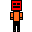
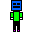
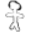
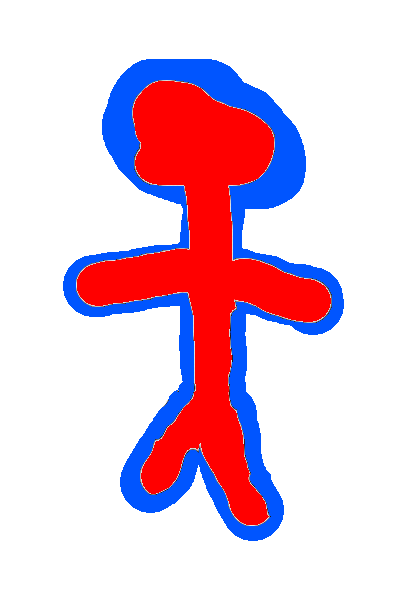
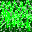

# These are the folders for the media


## characters
<details>
<summary>Rito.png</summary>
<br>
</details>

<details>
<summary>Rito_P2.png</summary>
<br>
</details>

<details>
<summary>test_char.png</summary>
<br>
</details>

<details>
<summary>test_char_P2.png</summary>
<br>
</details>

## background

<details>
<summary>water.png</summary>
<br>
</details>

<details>
<summary>dirt.png</summary>
<br>
</details>

<details>
<summary>grass.png</summary>
<br>
</details>

### some notes
The "engine" is expecting the "sprites" to be 32x32 pixels. 
If they're anything other than this it won't work.
You would need to modify the "SpriteComponents.h" file. 
Specifically, the "init()" function.
More specifically, 
```c++
 void init() override{
        position = &entity->getComponent<PositionComponent>();
        
        srcRect.x = 0;
        srcRect.y = 0;

        /* you would need to update these to match the size of your "sprite" */
        srcRect.w = 32; 
        srcRect.h = 32;
        ///
        
        destRect.w = 64;
        destRect.h = 64;

    }// init
```
