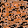

# These are the folders for the media

## characters
<details>
<summary>Rito.png</summary>
<br>
</details>

<details>
<summary>Rito_P2.png</summary>
<br>
</details>

<details>
<summary>test_char.png</summary>
<br>
</details>

<details>
<summary>test_char_P2.png</summary>
<br>
</details>

## background

<details>
<summary>water.png</summary>
<br>
</details>

<details>
<summary>dirt.png</summary>
<br>
</details>

<details>
<summary>grass.png</summary>
<br>
</details>

### some notes
* Tile maps take in input that looks like this from a .txt file
  * NOTE THAT THERE ARE NO SPACES BETWEEN THE NUMBERS AND COMMAS
```
0,0,0,0,0,0,0,0,0,0,0,0,0,0,0,0
1,1,1,1,1,1,1,1,1,1,1,1,1,1,1,1
2,2,2,2,2,2,2,2,2,2,2,2,2,2,2,2
0,0,0,0,0,0,0,0,0,0,0,0,0,0,0,0
1,1,1,1,1,1,1,1,1,1,1,1,1,1,1,1
2,2,2,2,2,2,2,2,2,2,2,2,2,2,2,2
0,0,0,0,0,0,0,0,0,0,0,0,0,0,0,0
1,1,1,1,1,1,1,1,1,1,1,1,1,1,1,1
2,2,2,2,2,2,2,2,2,2,2,2,2,2,2,2
0,0,0,0,0,0,0,0,0,0,0,0,0,0,0,0
1,1,1,1,1,1,1,1,1,1,1,1,1,1,1,1
2,2,2,2,2,2,2,2,2,2,2,2,2,2,2,2
0,0,0,0,0,0,0,0,0,0,0,0,0,0,0,0
1,1,1,1,1,1,1,1,1,1,1,1,1,1,1,1
2,2,2,2,2,2,2,2,2,2,2,2,2,2,2,2
0,0,0,0,0,0,0,0,0,0,0,0,0,0,0,0
```